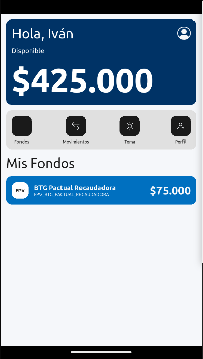
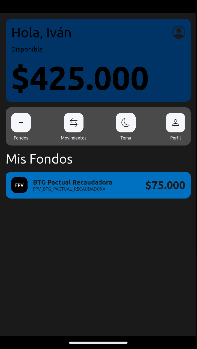
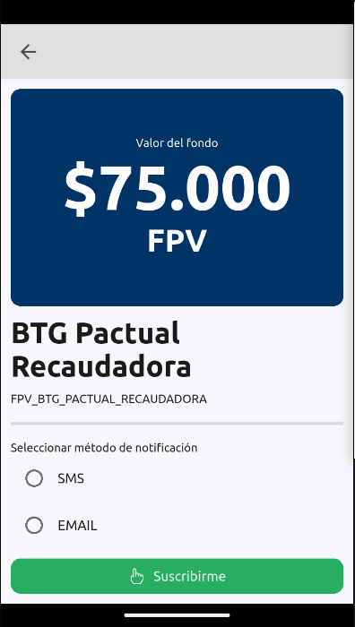
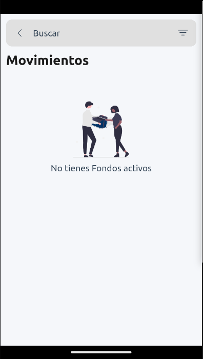
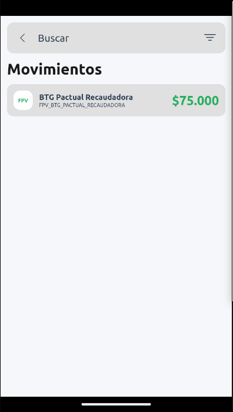
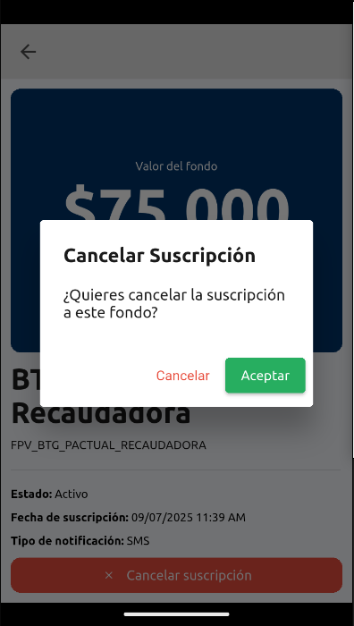
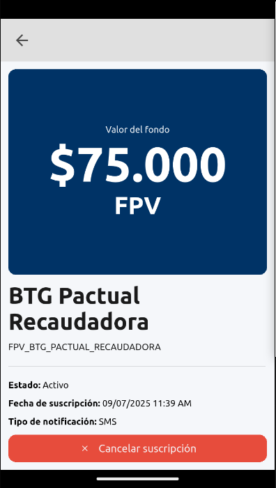
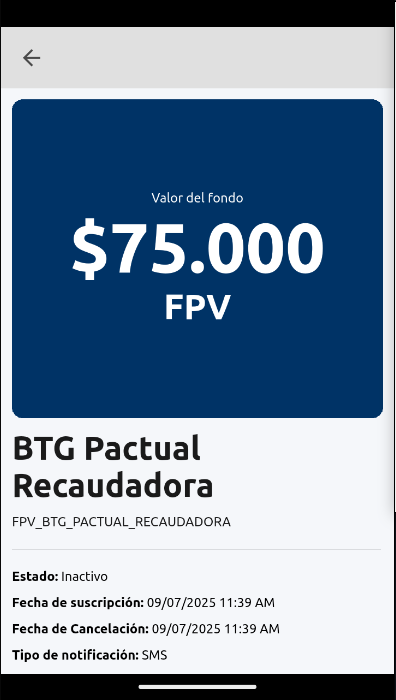
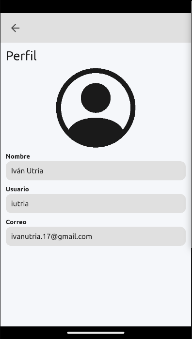

# aurum_btg

## 📱 Prueba Técnica Flutter – BTG

Esta aplicación fue desarrollada como parte de una prueba técnica para simular el manejo de fondos FPV/FIC para clientes de BTG.

---

### 🎨 Diseño UI

Se diseñó una interfaz amigable, moderna y clara utilizando Figma. Puedes visualizar los mockups aquí:

👉 [Ver mockups en Figma](https://www.figma.com/proto/ee7cEsVXKNBnzQHZwcXVpe/arum_btg?node-id=1-4&t=kYzdTFWAbUr5djKv-1&scaling=scale-down&content-scaling=fixed&page-id=0%3A1&starting-point-node-id=1%3A4&show-proto-sidebar=1)

---

### 🧭 Flujo de la aplicación

- Basado en la premisa *"Se asume un usuario único con saldo inicial de COP $500.000"*, se creó un archivo `.json` que contiene los datos del usuario y los fondos disponibles.
- La aplicación permite al usuario:
  1. Visualizar la lista de fondos disponibles.
  2. Suscribirse a un fondo, si cumple con el monto mínimo.
  3. Cancelar su participación en un fondo, y ver el saldo actualizado.
  4. Visualizar el historial de transacciones (suscripciones y cancelaciones).
  5. Seleccionar el método de notificación (Email o SMS) al suscribirse.
  6. Recibir mensajes de error adecuados si no hay saldo suficiente.

---

### 🛠️ Aspectos Técnicos

- ✔️ Interfaz intuitiva, centrada en la experiencia de usuario (UX).
- ✔️ Estructura de carpetas modular y limpia.
- ✔️ Uso de componentes y widgets reutilizables.
- ✔️ Navegación y ruteo implementados para estructurar las vistas de la aplicación.
- ✔️ Consumo de datos desde una API REST simulada (usando mocks locales o `json-server`).
- ✔️ Manejo adecuado de errores, estados de carga y retroalimentación visual.
- ✔️ Código limpio y estructurado, siguiendo buenas prácticas de diseño UI/UX.

> ❌ **Nota:** Por temas de tiempo, no se implementaron pruebas unitarias de componentes en esta entrega.

---

### 📁 Estructura del proyecto (directorio `lib`)

lib
└── app
    ├── config
    │   ├── assets
    │   └── hive
    ├── models
    ├── pages
    │   ├── details_fund
    │   │   ├── pages
    │   │   ├── providers
    │   │   ├── services
    │   │   └── widgets
    │   ├── error
    │   │   ├── pages
    │   │   └── widgets
    │   ├── funds
    │   │   ├── models
    │   │   ├── pages
    │   │   ├── providers
    │   │   └── widgets
    │   ├── home
    │   │   ├── pages
    │   │   ├── services
    │   │   └── widgets
    │   ├── profile
    │   │   ├── pages
    │   │   └── widgets
    │   ├── splash-screen
    │   │   ├── pages
    │   │   └── widgets
    │   ├── transactions
    │   │   ├── models
    │   │   ├── pages
    │   │   ├── providers
    │   │   └── widgets
    │   └── user_details_fund
    │       ├── pages
    │       ├── provider
    │       ├── services
    │       └── widgets
    ├── providers
    ├── routes
    ├── services
    ├── theme
    ├── utils
    └── widgets

---

### 🚀 Tecnologías utilizadas

- Flutter
- Provider
- Hive (almacenamiento local)
- JSON local / Mock API
- Figma (para diseño UI)

---

### 🚀 Cómo ejecutar el proyecto

1. **Clonar el repositorio**
   ```bash
   git clone https://github.com/iutria/aurum_btg.git
   cd aurum_btg

2. **Instalar dependencias**
   flutter pub get

3. **Ejecutar en modo desarrollo**
    flutter run

4. **Asegúrate de tener configurado correctamente tu entorno Flutter.**
    flutter doctor

### 🔐 Configuración de entorno

Se incluye un archivo `.env` en la raíz del proyecto con la configuración necesaria para conectarse al endpoint de la API simulada (MockAPI).


### 🖼️ Pantalla de inicio




### 🖼️ Pantalla de inicio dark



### 🖼️ Fondos


### 🖼️ Detalles y suscripción



### 🖼️ Movimientos




### 🖼️ Detalles de Movimientos





### 🖼️ Perfil


### 🎥 Demo de la aplicación

👉 [Ver video demo](https://github.com/iutria/aurum_btg/demo.webm)